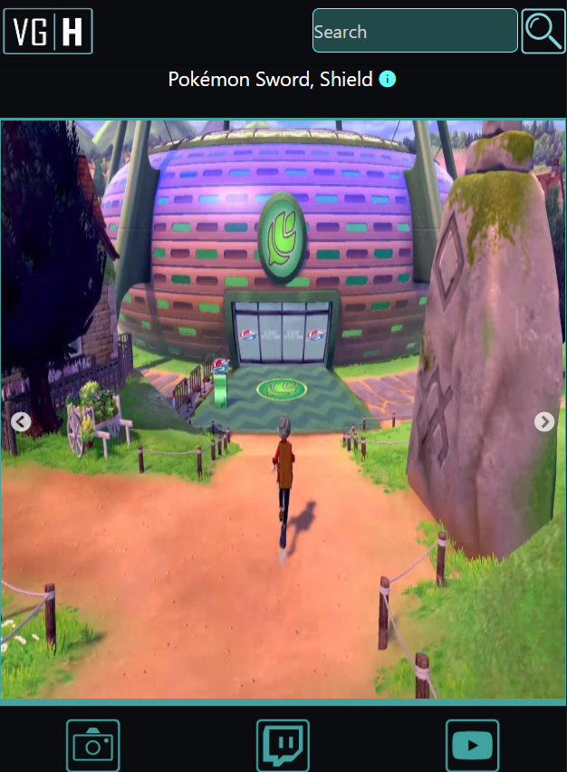
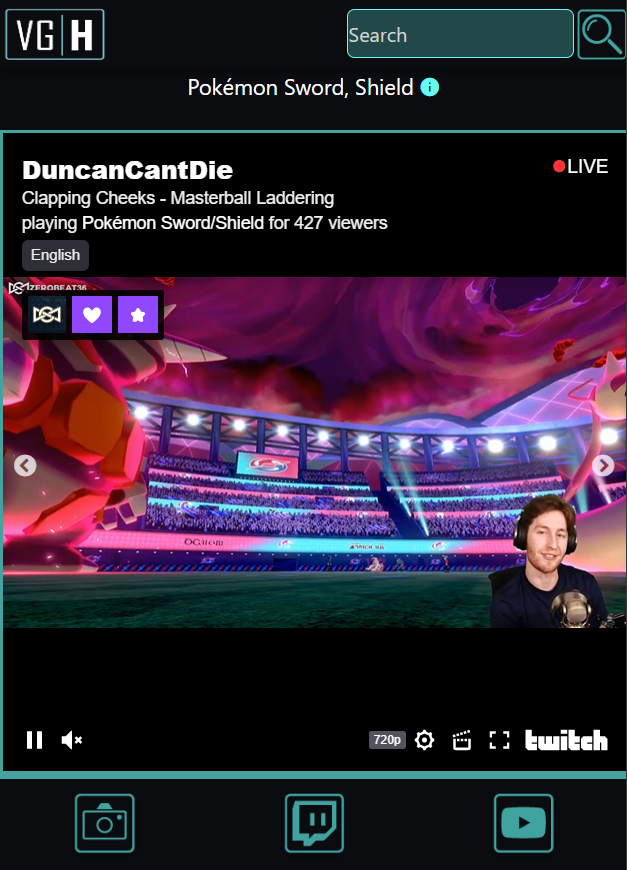
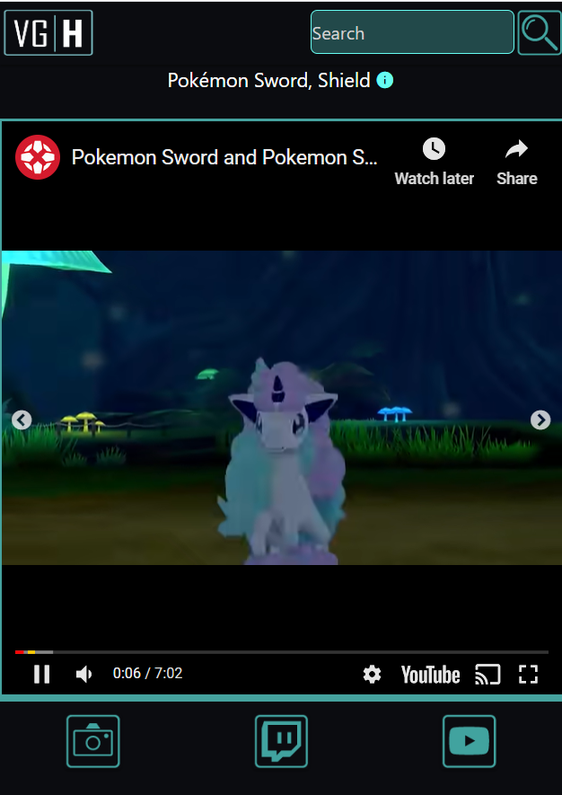
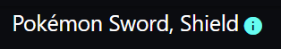
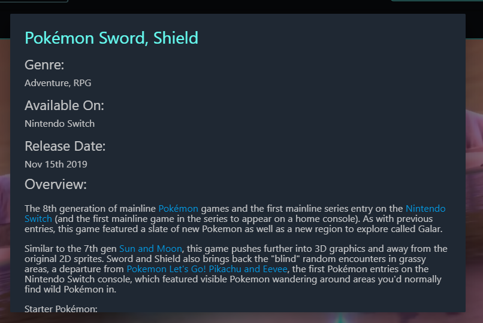

VG Hypeman was recreated from the ground up using Vue.JS follow these links to get to the github and new url.
New URL: https://dashboard.heroku.com/apps/vghypeman/deploy/github
New github: https://github.com/MatthewBryantDonovan/VGHypeman2.0

# VG Hypeman

Discover your next favorite video game or catch up on one you already love. Video Game Hypeman is built to bring you everything you need know about any game. Want to see Tweets from the game’s official Twitter? Coming right up! need some livestreams in your life? No problem we’ll pull the top streams from Twitch now! Video Game Hypeman is a powerful tool in your personal arsenal. Go ahead and try it out, it’s magic.

## Site Example -

If you end up searching 'Pokemon Sword ' you can view the following information -

1) Click the camera icon at the bottom to view pictures from the game -

2) Click the Twitch icon at the bottom to view Twitch Streams of the game -

3) Click the YouTube icon at the bottom to view YouTube reviews of the game -

4) Information about the game - 

Click on the little circle with an 'i' next to the game's name to display information about it.

## Meet the Team

